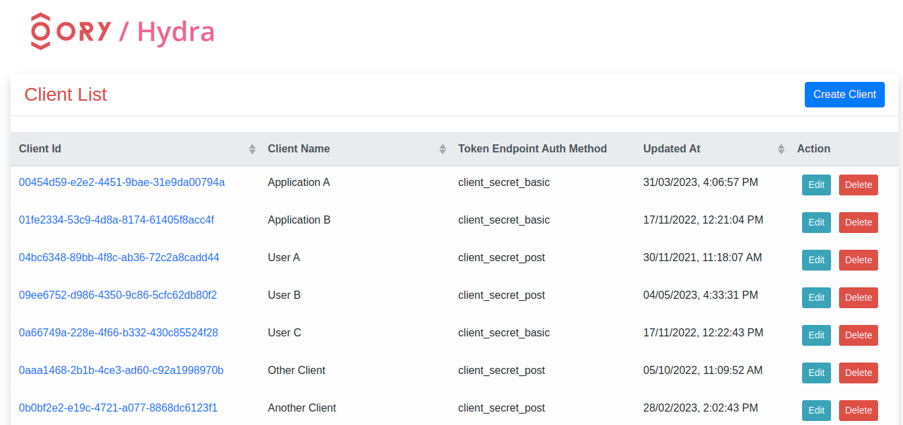

# Hydra Web Admin

Web Management UI for [Hydra OAuth Server](https://github.com/ory/hydra).

## Setup

* Copy `.env.example` to `.env` and change `HYDRA_PROXY_URL` for your hydra admin address.

```console
HYDRA_PROXY_URL=http://localhost:4445
PORT=3000
CLIENT_ID=7000
CLIENT_SECRET=7000
```

# Get Started

```console
npm install
npm run dev
```

Open your web browser in [localhost:3000](http://localhost:3000)


